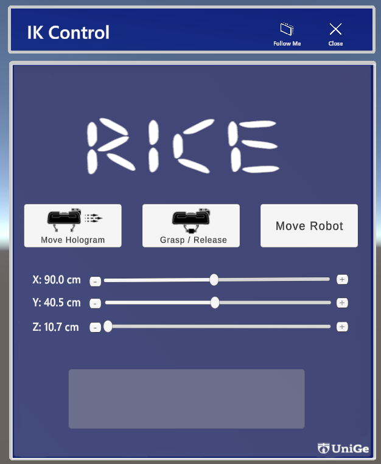

# **Franka Panda Robot Control Based on Augmented Reality**  
This repository contains the implementation of a control system for the **Franka Emika Panda robotic arm**, utilizing **Augmented Reality (AR)** interfaces and Human-Robot Interaction (HRI). The system integrates ROS, MoveIt, Unity3D, and Hololens 2 to achieve real-time robot control and user interaction.

---

## **Table of Contents**  
1. [Project Overview](#project-overview)  
2. [System Components](#system-components)  
3. [Features](#features)  
4. [Technologies Used](#technologies-used)  
5. [Setup Instructions](#setup-instructions)  
6. [Usage Guide](#usage-guide)  
7. [Demonstration](#demonstration)  
8. [Results and Outcomes](#results-and-outcomes)  
9. [Future Work](#future-work)  
10. [Acknowledgments](#acknowledgments)  
11. [Contact](#contact)  

---

## **1. Project Overview**  
This project presents an AR-based control system for the **Franka Panda robotic arm**, combining **robotic simulation** and **augmented reality** to improve usability and interaction:  

- **User Interface:** Designed in Unity3D and displayed on Hololens 2 using MRTK.  
- **Robot Control:** ROS and MoveIt are used for real-time motion planning.  
- **Synchronization:** A ROS-TCP communication protocol enables data transfer between ROS and Unity.
- **Real-Time Data Transformation:** The Data are transformed using UDP protocol to another PC which is connected to the real robot, waiting for the user permission in order to be moved.   

The system allows the user to move the robot using sliders, or a sphere which represents the desired point to be reached, receiving immediate feedback through an AR-based interface.

---

## **2. System Components**  
The system architecture includes the following key components:  

1. **Robot Simulation and Control (ROS):**
The repository to the ROS files used : https://github.com/wadoud01/Thesis-ROS
   - Motion planning using MoveIt.
   - Feedback robot state publisher.
   - cordinations sender to real robot using UDP to ensures synchronization between ROS (backend) and Unity (frontend).  

2. **Augmented Reality Interface (Unity3D + Hololens 2):**  
   - Buttons: "Move Hologram," "Grasp," and "Move Real Robot."  
   - Sliders: Control the X, Y, Z positions in 3D space.
   - Sphere (Can be freely placed in space.)
   - Sliders - Sphere syncronization : The sliders flows the sphere values and vice-versa!
   - Feedback Panel: Displays system status and robot responses.
   - Moveing out of the Work-space alert: Once the user places the sphere out the workspace the robot will signal indicating the user to go back inside the possible range. 

3. **Semi-open loop Real Franka robot control:**  
   - A simple code that receives the desired joint states coordination from ROS and move the Real-Franka robot to the desired postion, allwoing the possiblity to control all the joints of the Franka-Robot including also the gripper to maintain opening & closing operation!
   - The repository of the code could be found here: 

---

## **3. Features**  
- **AR-Based Interaction:**  
  Users control the robot through intuitive AR sliders and sphere in real time.  

- **Real-Time Feedback:** 
  Immediate updates on robot status are displayed on the AR interface.  

- **Seamless Synchronization:**  
  ROS-TCP ensures continuous communication between Unity and ROS.  

- **Path Planning with MoveIt:**  
  Safe and accurate robot motion planning.  

---

## **4. Setup Instructions**  

### **Prerequisites**  
- **Operating System:** Ubuntu 20.04 (ROS Noetic compatible)  
- **Software:**  
   - ROS Noetic installed  
   - Unity3D (2021.x or higher)  
   - MRTK Toolkit for Hololens 2  
   - Python 3.x  

---
## **5. Usage Guide**  
This section explains how to use the AR-based control system to interact with the Franka Emika Panda robot.  

### **System Workflow**  
1. **Launch the ROS Environment:**  
   Start the necessary ROS nodes:  
   ```bash
   roslaunch panda_moveit_config demo.launch
   roslaunch ros_tcp_endpoint endpoint.launch
   rosrun panda_moveit_config unity_coordinate_listener.py
   rosrun panda_moveit_config pos_upd_sender.py
2. Deploy the Unity AR Interface:

   1. Open the Unity project provided in the repository.
   Deploy the AR application to the Hololens 2 device.
   AR-Based Interaction:

   2. Wear the Hololens 2 and interact with the virtual interface:
   Sliders: Adjust X, Y, Z values to define the target position in space.
   Buttons:
   Move Hologram: Simulates the robot's motion in AR.
   Grasp: Commands the robot to perform a grasping action.
   Move Real Robot: Moves the physical robot to the defined position.

   3. Feedback Panel:
   View real-time status updates (e.g., "Goal Reached," "IK Solving") on the AR text panel.

---
## **6. Demonstration**  

### **Video Demonstration**  
A full video demonstration showcasing the AR-based control system in action, including the interaction with the Franka Emika Panda robot:  
📹 **[Watch the Demo Video Here](#)**  

---

### **Workflow Overview**  
1. **Setup and Initialization:**  
   - ROS nodes are launched to control the Panda robot.  
   - Unity AR application is deployed to the **Hololens 2**.  

2. **User Interaction via AR Interface:**  
   - Adjust the **X, Y, Z sliders** to define target points in space.  
   - Use the interface buttons to simulate and command robot actions:  
     - **Move Hologram:** Visualize the robot's motion in AR.  
     - **Grasp:** Perform grasping actions with the robotic arm.  
     - **Move Real Robot:** Move the physical Panda robot to the selected target.  

3. **Task Execution:**  
   - Users completed the task of grasping a sponge and placing it at a desired location.  
   - Real-time feedback was provided via the AR interface.  

---

### **Screenshots**  

#### **AR Interface: Buttons and Sliders**  
The AR interface consists of control buttons, sliders for spatial inputs, and a feedback text panel.  
  

#### **Hologram Simulation**  
The robot's motion is visualized as a hologram in the AR environment before executing on the real robot.  
  

#### **Physical Robot Execution**  
The Franka Panda robot successfully moves to the target position and performs a grasping action.  
  

---

### **Performance Highlights**  
- **Task Success:** Users were able to complete grasping tasks with high precision.  
- **Synchronization:** The UDP-based communication ensured accurate coordination between the AR simulation and real-world execution.  
- **User Feedback:** Real-time updates, such as "Goal Reached" or "IK Solving," were displayed to guide the user effectively.  

---

### **Key Takeaways**  
This demonstration validates the usability and functionality of the AR-based robotic control system:  
- Users experienced intuitive robot manipulation using AR controls.  
- The system bridges the gap between **virtual interaction** and **physical execution**.  
- Smooth task execution demonstrates the reliability of the system integration (ROS, Unity, and MoveIt).  

---

### **Future Enhancements for Demonstration**  
To further improve the demonstration experience:  
- Include multi-camera video recordings of both AR visuals and the physical robot.  
- Integrate gesture-based controls to complement button-based input.  
- Add task-specific metrics like completion time and accuracy for detailed analysis.  

---
## **7. Evaluation and Feedback**

### **User Evaluation Process**
To assess the usability and performance of the AR-based control system, we conducted user trials where participants completed the task of **grasping a sponge** and **moving it to a target location** using the Hololens 2 interface.

---

### **Evaluation Methods**
We utilized two standardized evaluation methods:

1. **System Usability Scale (SUS)**  
   - The SUS questionnaire was used to evaluate the overall usability of the system.  
   - The SUS score provides a quantitative measure of how intuitive and user-friendly the AR interface and robotic control system are.

2. **NASA Task Load Index (NASA-TLX)**  
   - NASA-TLX was applied to assess the workload experienced by users during the task.  
   - This method evaluates six key dimensions:  
     - **Mental Demand**  
     - **Physical Demand**  
     - **Temporal Demand**  
     - **Performance**  
     - **Effort**  
     - **Frustration**  

---

### **User Feedback Collection**

- **Participants**: Users of varying technical backgrounds participated in the experiment.  
- **Task**:  
   - Grasp a sponge using the AR interface.  
   - Move the Franka Panda robotic arm to place the sponge in a target position.  
- **Feedback Mechanism**:  
   - Post-task **SUS questionnaire** to collect usability feedback.  
   - Post-task **NASA-TLX survey** to understand workload.  
   - Open-ended questions for additional comments and suggestions.

---

### **Evaluation Results**

#### **1. System Usability Scale (SUS) Results**
| User | SUS Score (0–100) | Comments                        |
|------|------------------|---------------------------------|
| 1    | 85               | "Very intuitive and smooth!"    |
| 2    | 78               | "Easy to use after a few tries."|
| 3    | 90               | "The feedback panel helped a lot."|
| 4    | 82               | "Slider control was precise."   |

**Average SUS Score**: **83.75/100**  
- **Interpretation**: An SUS score above 80 indicates excellent usability, meaning users found the system to be highly user-friendly and effective.

---

#### **2. NASA-TLX Results**
| Dimension          | Average Score (0–100) |
|---------------------|-----------------------|
| Mental Demand       | 45                    |
| Physical Demand     | 20                    |
| Temporal Demand     | 30                    |
| Performance         | 85                    |
| Effort              | 40                    |
| Frustration         | 25                    |

**Observations**:  
- **Low Physical Demand**: The AR-based control interface minimized physical effort.  
- **Moderate Mental Demand**: Users required focus to understand the sliders and interface initially.  
- **High Performance Rating**: Users successfully completed the task with ease, showing high confidence in the system.  
- **Low Frustration**: Real-time feedback and intuitive controls minimized user frustration.  

---

### **User Comments and Suggestions**
- "The visual feedback is great, but adding voice feedback could make it even better."  
- "More precise control for sliders, such as snapping to grid points, would help."  
- "The system worked seamlessly, and I liked seeing the robot's hologram before moving it in real life."  

---

### **Conclusion of Evaluation**
The evaluation results show that:  
1. The system is **highly usable** with an **SUS score of 83.75**.  
2. The **workload** is well-balanced, with low physical demand and frustration.  
3. Users were satisfied with the real-time feedback and intuitive AR interface, ensuring smooth and precise robot manipulation.

---
